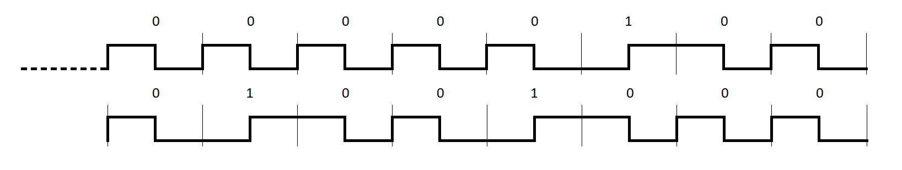
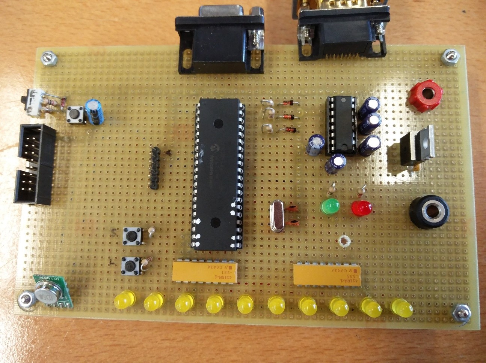

# Walkie-Textie

The overall project is to implement a system similar to a Walkie-Talkie, but using text messages transmitted by radio frequency.
The described system requires three devices:

* A __Java__ program running on a computer that allows to write a message and transmit it via a __serial interface__ to the next device.
* A second device formed by a PIC (programmed in __assembly__), a __radio frequency emitter__ and a __serial interface__. This second device transmits the message received from the computer to the third device using radio frequency.
* A third device formed by a PIC (programmed in __C__) and a __radio frequency receiver__. This device receives the message originally sent from the computer (via the second device) and shows it in its LCD screen.

This particular project is the [asm](main.asm) code of the second device.

## Walkie-asm

At a more detailed level, this device consists of a serial channel, a radio frequency transmitter, two push buttons, ten LEDs and a PIC.

When the PIC starts running, it expects and action on the part of the user. This action can be a serial transmission from the computer or one of the two buttons on the perfboard.

On the one hand, if it's a message from the computer requesting to load a message, it initiates a communication protocol where, after an initial byte (SYN) and the proper answer (ACK), the computer transmits byte to byte the message, while the PIC answers ACK's to make sure that is following the frame. A last special byte is used as a FIN signal.

On the other hand, if the user has pressed the _requestMessage_ button, the device will send a request to the computer and will start the serial transmission process described above (if there's a message).

The other functionality is sending through radio frequency the loaded message. This can either be activated from the computer or using the second button on the perfboard. Using the radio frequency transmitter, it sends a the message attaching as a prefix an ID, which is 0x0448.
The message is sent in Manchester encoding:
* Each bit is transmitted in a __fixed time__, which is the period of the transmission.
* The __0__ is represented by __high-to-low__ transition.
* The __1__ is represented by __low_to_high__ transition.
* Each transition is made at the __midpoint of the period__.

The result is an encoding starting with the following header, which represents 0x0448.

The last bit of this frame's header is followed by the content of the message already encoded.

### Perfoard

The final implementation of this second device is build in the next perfboard:

As it can be appreciated, it has more components than the described, because it's made on top of another project which involved a __VGA video signal generation__ in __assembly__.
